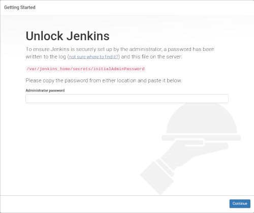
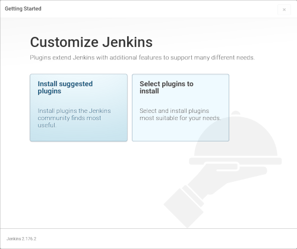
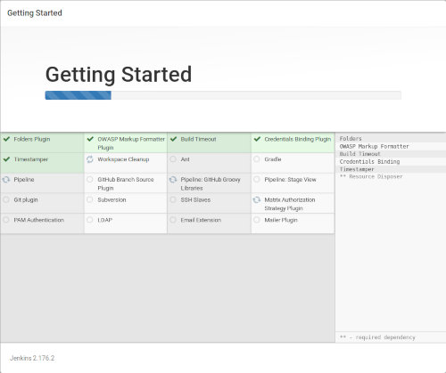
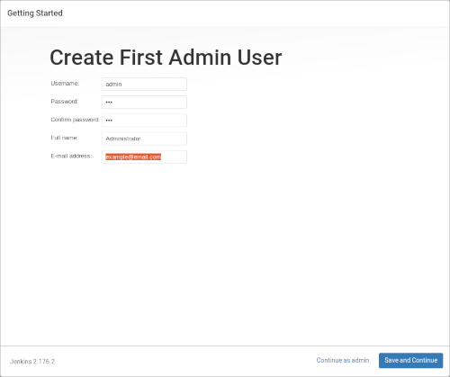
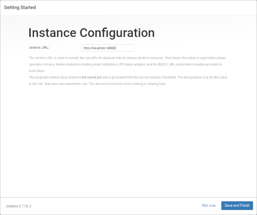
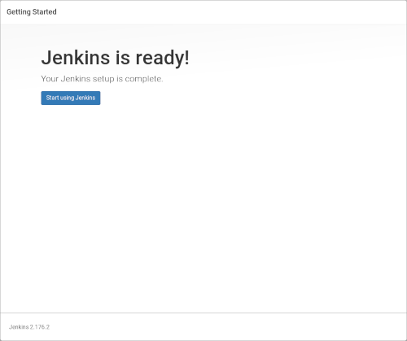
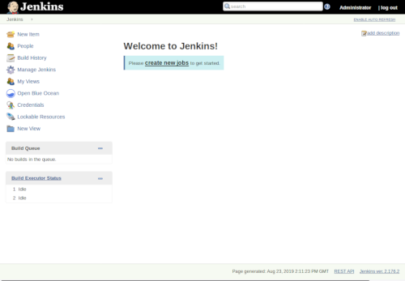

# Simple Jenkins Pipeline Workspace
Simple Jenkins Pipeline Workspace

## Get Start
All instruction below was executed at Linux OS. Remember that you need to have [git](https://git-scm.com/downloads), [docker](https://docs.docker.com/install/#supported-platforms) and [docker-compose](https://docs.docker.com/compose/install/) installed.

### Up Environment
Execute the steps below:
```bash
mkdir -p "${HOME}/workspace"
cd "${HOME}/workspace"
# if it doesn't work! Go to git repository and use the HTTP version
git clone git@github.com:helionogueir/simple-jenkins-pipeline-workspace.git
docker-compose up
```

### Setup Jenkins
__\#1__ - After execute __docker-compose up__ you'll see the follow text:
```bash
*************************************************************
*************************************************************
*************************************************************

Jenkins initial setup is required. An admin user has been created and a password generated.
Please use the following password to proceed to installation:

f65baf02ab354ea5a994b5bb6b0365c8

This may also be found at: /var/jenkins_home/secrets/initialAdminPassword

*************************************************************
*************************************************************
*************************************************************
```
__\#2__ - Ok. Now you need copy _(ctrl + c)_ the code ***f65baf02ab354ea5a994b5bb6b0365c8*** in bash. Remember this code will be diferente in each instalation.

__\#3__ - Open your browser and access the address _[http://localhost:8080/](http://localhost:8080/)_. You'll see the follow page.



__\#4__ - Paste _(ctrl + v)_ the code _(Ex: f65baf02ab354ea5a994b5bb6b0365c8)_ in field ***Administrator password***. Then click in ***Continue*** button.

__\#5__ - Nice! Click in ***Install suggested plugins*** button.



Waiting the installation to finish.



__\#6__ - Fill the form informations and click in ***Save and Continue*** button.



Click in ***Save and Finsish*** button.



Click in ***Start using Jenkins*** button.



Great! Jenkins is installed and ready.



Now access [http://localhost:8088/](http://localhost:8088/) in your browser.